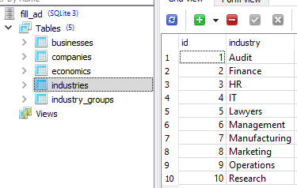
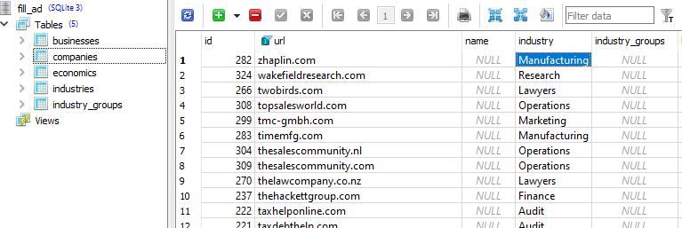
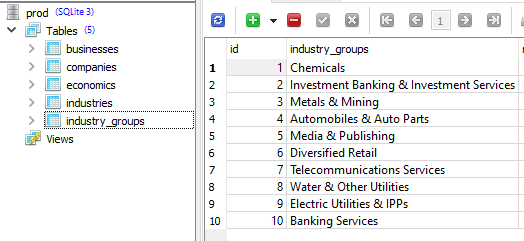
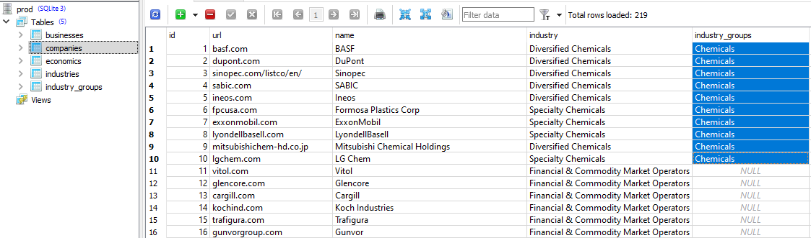
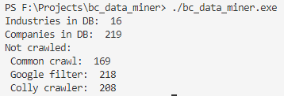

# Business Data Miner
## What is this?
This miner collects documents (mostly HTMLs, PDFs) using 3 crawling methdods incorporated in it:
* [GoCommonCrawl](https://github.com/karust/goCommonCrawl) - WebArchive crawler
* [Google](https://gist.github.com/EdmundMartin/eaea4aaa5d231078cb433b89878dbecf) - Obtaining documents from Google using search query parameters
* [Colly](https://github.com/gocolly/colly) - Web crawler 

Each of these crawlers has advantages and downsides (google captcha e.g.), but they complement each other well. Miner stores file sorted by defined classes (topics, industries).

## Usage
### **1. Create and fill database**
First you need to collect URLs of companies information from which you want to gather and assign them to some class. For example it is possible to use [*Thomson Reuters business classification*](https://en.wikipedia.org/wiki/Thomson_Reuters_Business_Classification) of companies or you can assign URLs to the topics that you want.

* Data is stored in SQLite format so you need to create such database or modify existing one to your suits. To assign your own classes (categories) you should use `Industries` table and them there:
<p align="center"></p>

* After industries were determined you should collect URLs and save them in `Companies` table assigning industry to each of them:
<p align="center"></p>

* Sometimes it is hard to determine specific industry of some company. In such situations you could determine general groups of indutries in `Industry_groups` table:
<p align="center"></p>

* Industry group also should be assigned to URL in `Companies` table. Industry and it's group can be present both at the same time, but the data will be categorized by a group (higher priority):
<p align="center"></p>

### **2. Configure**
Configuration file `config.toml` should be put alongside with miner executable. You should set path to the previously created database in `general` block. There are configuration blocks for each crawler, you can turn off some of them and set other parameters there. The **important** part is to set `path` for each crawler to the directory where the data will be saved:
```TOML
[general]
database = "prod.db"        # Location of SQLite database

[common]
use = true                  # Use this crawler or not
path = "data/common"        # Where collected data will be saved
debug = false               # Show debug output
extensions = [".html", ".pdf", ".doc", ".txt"]        # Which files to save. If empty - save all files
max_amount = 100                # Limit amount of downloaded files
timeout = 30                    # Query to Common Crawl Index API may take time
search_interval = 2             # In seconds. Do not overload Index API server
crawl_db = "CC-MAIN-2019-22"    # Web Archive version 
wait_time = 53                  # In milliseconds. Wait time between loads from Amazon S3
workers = 40                    # Number of goroutines (threads) for this crawling method

[google]
use = true
path = "data/google"
debug = false
extension = "pdf"       # Which files to search
search_interval = 30    # In seconds
max_file_size = 35      # In megabytes
workers = 40

[colly]
use = true
path = "data/colly"
debug = false
extensions = [".html", ".pdf", ".doc", ".txt"]       
max_amount = 100
max_file_size = 35      # In megabytes
max_html_load = 50      # Total size of HTML files in folder. In megabytes
work_minutes = 30
workers = 10
random_name = true     # Add randmon prefix to file
```

**Note:** Folders for each crawler's `path` should be created manually if they not exist.

### **3. Build and run**
* Get dependencies:
```
go get -u github.com\karust\gocommoncrawl
go get -u github.com\jinzhu\gorm\dialects\sqlite
go get -u github.com\jinzhu\inflection
go get -u github.com\gocolly\colly
go get -u github.com\BurntSushi\toml
```
* Build and run:
```
go build .
./bc_data_miner.exe
```

* Upon successful launch, you should see a little report of how many companies each crawler should do:
<p align="center"></p>

* The data miner can be stopped anytime, the progress will be saved in database.